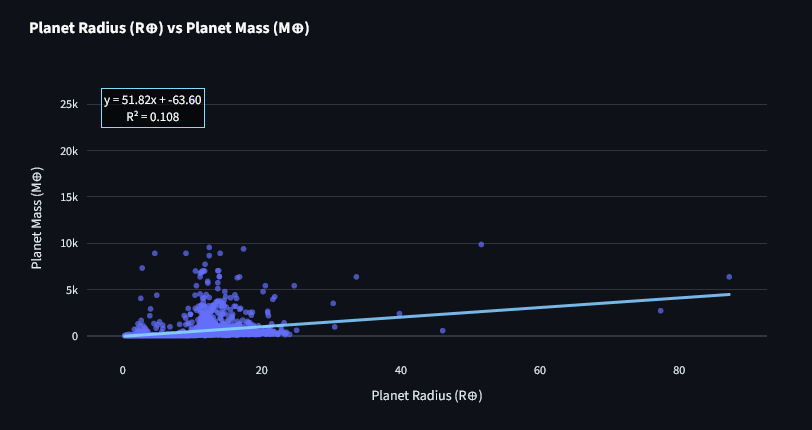
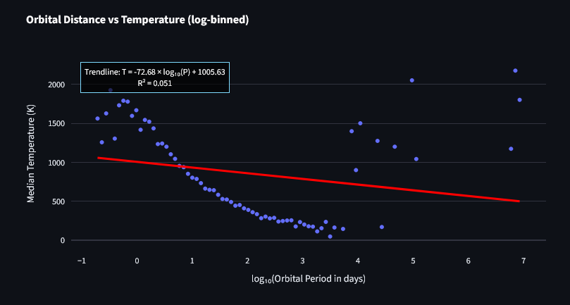
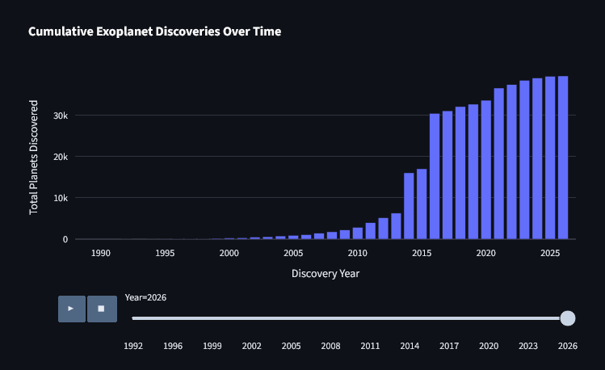
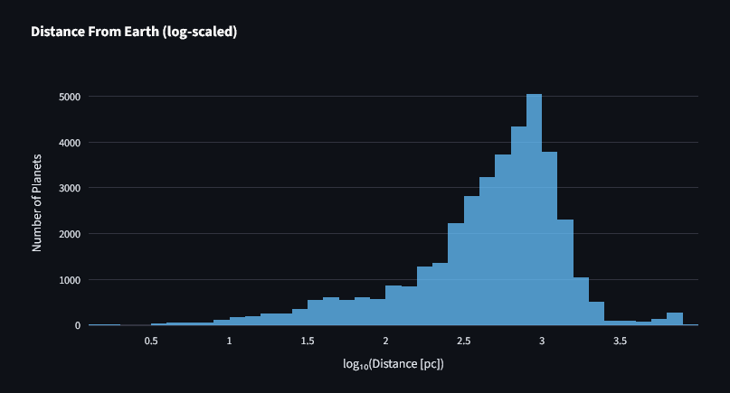
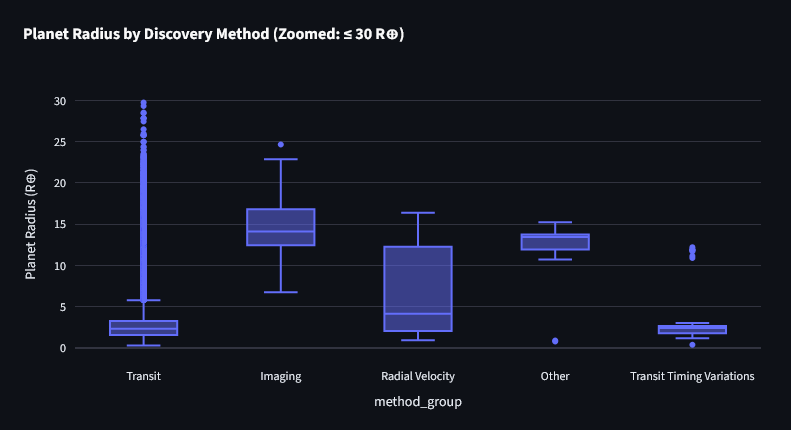
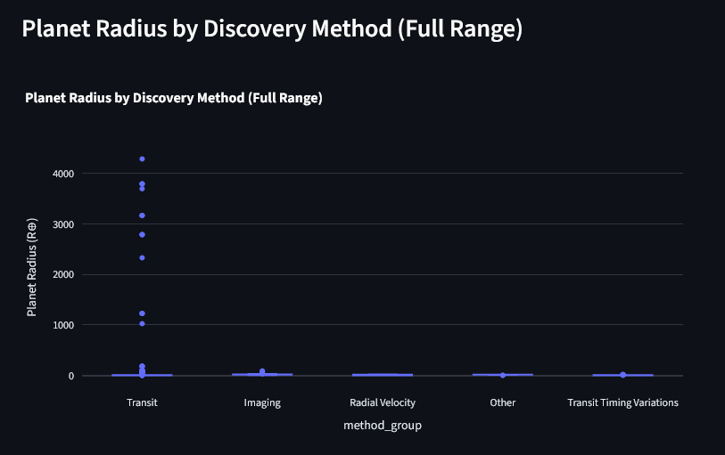

## TODO
- [x] Update intro
- [x] Update screenshots from pyqt6 to streamlit demo
- [ ] Update manual setup section


<h1 align="center">🔭 NASA Exoplanet Query App</h1>
<p align="center"> A Streamlit-powered web application for exploring NASA’s Exoplanet Archive through interactive queries and engaging visualizations. </p>

<p align="center"> 🚀 Live Demo: <a href="https://exoplanetquery.streamlit.app">exoplanetquery.streamlit.app</a> </p>

# 🌟 Features

### 🔍 Interactive Querying
#### Filter planets by:
- Name
- Discovery Year
- Discovery Method
- Host Star
- Discovery Facility
- And more!

Results appear in a clean, sortable table with friendly labels.

### 📊 Curated Scientific Visualizations
#### All charts are built with Plotly and tuned for mobile:
- **Planet Radius vs Planet Mass** (with trendline + R² annotation)
- **Orbital Distance vs Temperature** (log-binned smoothing option)
- **Cumulative Exoplanet Discoveries Over Time** (animated!)
- **Distance From Earth Histogram** (log-distance scaling)
- **Discovery Method Radius Distributions** (zoomed + full-range boxplots)

### 🌍 Fully Web-Based
#### No installation required; runs directly in your browser.

## 📸 Visualization Gallery

| Planet Radius vs Mass | Temperature vs Orbital Distance |
|----------------------|----------------------------------|
|  |  |

| Cumulative Discoveries (Animated) | Distance From Earth Histogram |
|-----------------------------------|-------------------------------|
|  |  |

| Discovery Method Radius Boxplots (Zoomed) | Full Range Boxplots |
|-------------------------------------------|----------------------|
|  |  |


# 📦 Project Structure
```
exoplanet_query/
│
├── app.py                 # Streamlit UI
├── controller/            # Query filtering logic
├── database/              # Data loading / caching
├── plot/                  # Plot construction functions
├── screenshots/           # Demo screenshots
└── requirements.txt
```

## Manual Setup
### Prerequisites
- Python 3.6+
- Additional dependencies listed in `requirements.txt`

1. Clone the repository:
   ```sh
   git clone https://github.com/Malcolmcjackson/NASA-Exoplanet-Query-App.git
   ```

2. Navigate to the project directory:
    ```sh
    cd NASA-Exoplanet-Query-App/exoplanet_query/
    ```

3. Create a virtual environment:
    ``` sh
    python -m venv venv
    ```

4. Activate the virtual environment:
    - On Windows:
        ```sh 
        venv\Scripts\activate
        ```
    - On macOS and Linux:
        ```sh 
        source venv/bin/activate
        ```
5. Install dependencies:
    ```
    pip install -r requirements.txt
    ```

### Usage
1. Ensure the virtual environment is activated:
    - On Windows:
        ```sh 
        venv\Scripts\activate
        ```
    - On macOS and Linux:
        ```sh 
        source venv/bin/activate
        ```
2. Run "main.py":
    ```
    python exoplanet_query/main.py
    ```
    - Use the main window to query exoplanet data.

    - Open the secondary window to visualize data with plots.
        -  Use the main window to query exoplanet data.
        - Open the secondary window to visualize data with plots.

---
## Release Version
### For Linux and macOS
1. Download the executable from the [GitHub Releases Page](https://github.com/Malcolmcjackson/NASA-Exoplanet-Query-App/releases).
2. Extract the downloaded file:
    ```sh
    tar -xzf exoplanet_query.tar.gz
    ```
3. Set executable permissions:
    ```sh
    chmod +x exoplanet_query
    ```
4. Run the executable:
    ```sh
    ./exoplanet_query
    ```
### For Windows
- Coming soon
---
## Potential Improvements
Potential features to be implemented in the future:

- Enable exporting query results to various file formats (CSV, JSON, etc.).
- Implement more advanced data visualization options, such as 3D plots and interactive graphs.
- Add support for filtering data by additional criteria (such as planet radius, mass, and distance from Earth).
- Implement hyperlinking to the NASA Exoplanet website when a planet name is clicked for more detailed information.
- Switch frameworks from PyQt6 to something more lightweight.
- Deploy a web demo using Flask/Django and AWS.
- Release Windows build (exe, or an installer)
