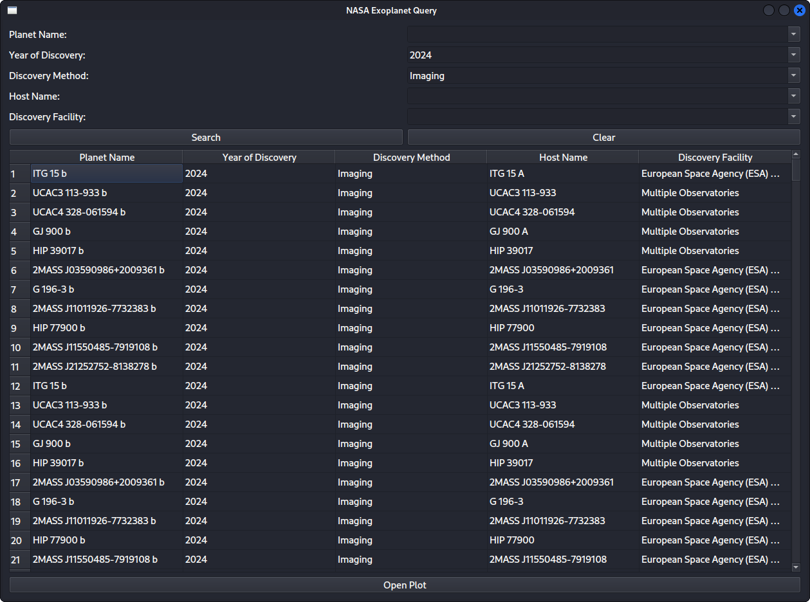

<h3 align="center">NASA-Exoplanet-Query-App</h3>
  <p align="center"> An application that allows users to query and visualize NASA's exoplanet archive, written in Python</p>

## Features
- Query exoplanet data by name, discovery year, method, host name, and facility.
- Display results in a sortable table.
- Generate customizable plots for data visualization.

## Screenshots

Query Window            |  Plot Window
:-------------------------:|:-------------------------:
    |    

---
## Manual Setup
### Prerequisites
- Python 3.6+
- Additional dependencies listed in `requirements.txt`

1. Clone the repository:
   ```sh
   git clone https://github.com/Malcolmcjackson/NASA-Exoplanet-Query-App.git
   ```

2. Navigate to the project directory:
    ```sh
    cd NASA-Exoplanet-Query-App/exoplanet_query/
    ```

3. Create a virtual environment:
    ``` sh
    python -m venv venv
    ```

4. Activate the virtual environment:
    - On Windows:
        ```sh 
        venv\Scripts\activate
        ```
    - On macOS and Linux:
        ```sh 
        source venv/bin/activate
        ```
5. Install dependencies:
    ```
    pip install -r requirements.txt
    ```

### Usage
1. Ensure the virtual environment is activated:
    - On Windows:
        ```sh 
        venv\Scripts\activate
        ```
    - On macOS and Linux:
        ```sh 
        source venv/bin/activate
        ```
2. Run "main.py":
    ```
    python exoplanet_query/main.py
    ```
    - Use the main window to query exoplanet data.

    - Open the secondary window to visualize data with plots.
        -  Use the main window to query exoplanet data.
        - Open the secondary window to visualize data with plots.

---
## Release Version
### For Linux and macOS
1. Download the executable from the [GitHub Releases Page](https://github.com/Malcolmcjackson/NASA-Exoplanet-Query-App/releases).
2. Extract the downloaded file:
    ```sh
    tar -xzf exoplanet_query.tar.gz
    ```
3. Set executable permissions:
    ```sh
    chmod +x exoplanet_query
    ```
4. Run the executable:
    ```sh
    ./exoplanet_query
    ```
### For Windows
- Coming soon
---
## Potential Improvements
Potential features to be implemented in the future:

- Enable exporting query results to various file formats (CSV, JSON, etc.).
- Implement more advanced data visualization options, such as 3D plots and interactive graphs.
- Add support for filtering data by additional criteria (such as planet radius, mass, and distance from Earth).
- Implement hyperlinking to the NASA Exoplanet website when a planet name is clicked for more detailed information.
- Switch frameworks from PyQt6 to something more lightweight.
- Deploy a web demo using Flask/Django and AWS.
- Release Windows build (exe, or an installer)
